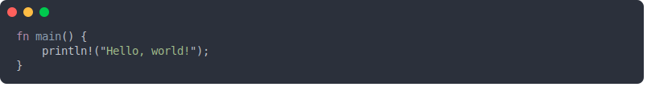

# Tin



Create vector images of your source code! It's like a screenshot, but better. Tin is an alternative
to [Carbon](https://carbon.now.sh) and [Silicon](https://github.com/Aloxaf/silicon) that outputs a vector image instead of a raster image.
This allows the image to be resized without losing quality.

## Installation

```bash
cargo install tin
```

You can also download the binary from the [releases](https://github.com/thejhnsn/tin/releases) page or build it
yourself:

```bash
git clone https://github.com/thejhnsn/tin
cd tin
cargo install --path .
```

## Usage

```bash
tin [OPTIONS] <input>
```

## Themes

Tin uses [TextMate](https://macromates.com/manual/en/language_grammars) themes (`.tmTheme` files) for syntax highlighting.

To add custom themes, place them in the themes directory inside your config folder:
* Windows: `%LOCALAPPDATA%\tin\themes`
* Unix/Linux: `~/.config/tin/themes`

You can verify which themes are detected by running:

```bash
tin --list-themes
```

## Command-Line Options

### General

| Option | Description | Default |
| :--- | :--- | :--- |
| `-o, --output <PATH>` | Output file path | `./out.svg` |
| `--language <LANG>` | Source language (inferred if skipped) | *Auto* |
| `-h, --help` | Print help information | - |
| `-V, --version` | Print version information | - |

### Appearance

| Option | Description | Default |
| :--- | :--- | :--- |
| `--theme <THEME>` | Color theme to use | `base16-mocha.dark` |
| `--list-themes` | List all available themes | - |
| `--font <FONT>` | Font family | `monospace` / `Consolas` |
| `--embed-font` | Embed the font in the SVG | `false` |
| `--line-spacing <NUM>` | Line spacing factor | `4` |
| `--line-numbers` | Show line numbers | `false` |
| `--lines <RANGE>` | Lines to include (e.g. `1,5-10`) | *Whole file* |

### Highlighting

| Option | Description | Default |
| :--- | :--- | :--- |
| `--highlight-lines <RANGE>` | Lines to highlight (e.g. `1,5-10`) | - |
| `--highlight-color <COLOR>` | Highlight color (Hex/CSS) | *Theme background* |
| `--highlight-mode <MODE>` | Highlight style (`full`, `fit`, `align-right`) | `fit` |
| `--highlight-columns <COLS>` | Highlight columns (e.g. `1,5,20;10,1,15`) | - |

### Window

| Option | Description | Default |
| :--- | :--- | :--- |
| `--window-title <TITLE>` | Window title text | - |
| `--window-decorations <STYLE>` | Style (`mac-os`, `windows`, `none`) | `mac-os` |
| `-r, --corner-radius <NUM>` | Corner radius | `8` |
| `--min-width <NUM>` | Minimum image width | `800` |

### Shadow

| Option | Description | Default |
| :--- | :--- | :--- |
| `--no-shadow` | Disable drop shadow | `false` |
| `--composite-shadow` | Use composite shadow (better compatibility) | `false` |
| `--shadow-blur <NUM>` | Shadow blur radius | `1` |
| `--shadow-color <COLOR>` | Shadow color | `#444444` |
| `--shadow-opacity <NUM>` | Shadow opacity | `0.5` |
| `-x, --shadow-offset-x <NUM>` | Horizontal shadow offset | `4` |
| `-y, --shadow-offset-y <NUM>` | Vertical shadow offset | `4` |

## Building

Clone the repository and build the project with Cargo:

```bash
cargo build --release
```

You may need to install the following dependencies:

* `Debian/Ubuntu`: `sudo apt install pkg-config libfreetype6-dev libfontconfig1-dev`
* `Fedora/RHEL`: `sudo dnf install pkg-config freetype-devel fontconfig-devel`

## Exporting to PNG

To convert the vector output to PNG, we recommend using [SVG to PNG](https://vincerubinetti.github.io/svg-to-png/).
Standard tools like InkScape or ImageMagick may not render the shadows or specific SVG features correctly.